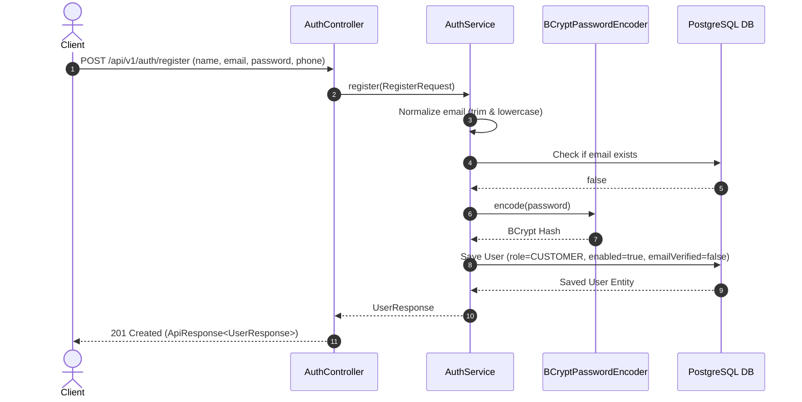
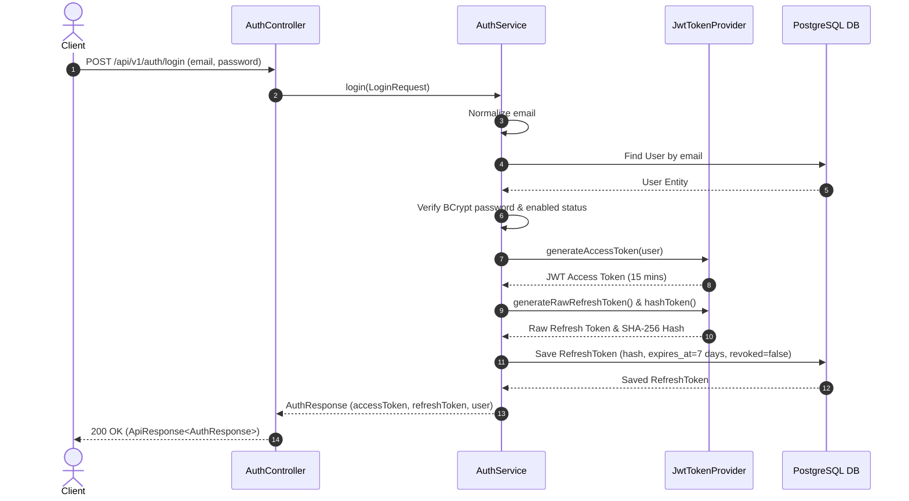
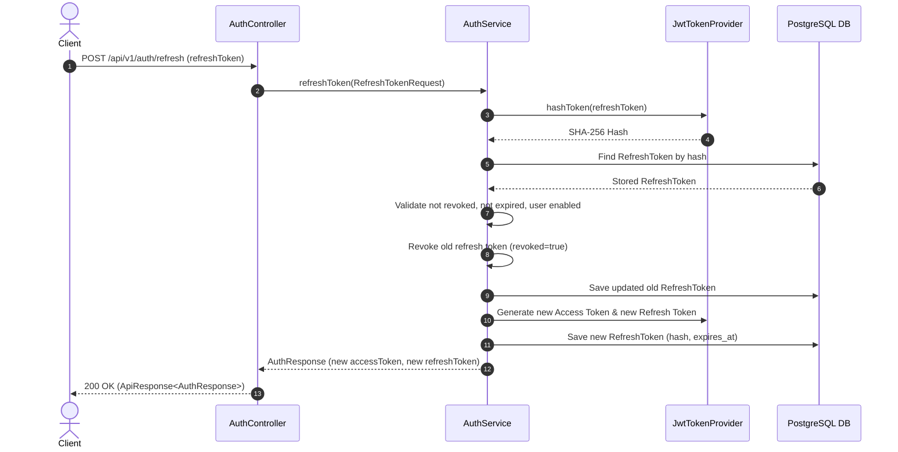

# JerseyHub Authentication & Security Specification

## 1. Overview

JerseyHub implements a stateless, token-based authentication and authorization infrastructure using Spring Security 6, BCrypt password hashing, short-lived JWT access tokens, and persisted refresh tokens with automatic token rotation.

---

## 2. Authentication Flow Diagrams

### Registration Flow


### Login & Token Issuance Flow


### Refresh Token Rotation Flow


---

## 3. JWT Claims Structure

Access tokens are signed using HS256 HMAC key derived from `JWT_SECRET`.

### Claims Payload
```json
{
  "sub": "b3e94a80-7c2d-4e9b-9c12-8f67e4112345",
  "userId": "b3e94a80-7c2d-4e9b-9c12-8f67e4112345",
  "email": "john.doe@example.com",
  "role": "CUSTOMER",
  "iat": 1770559200,
  "exp": 1770560100
}
```

* Sensitive information (passwords, hashes, address details) is strictly omitted from claims.

---

## 4. Endpoints Summary

| Endpoint | Method | Access | Description |
| :--- | :--- | :--- | :--- |
| `/api/v1/auth/register` | `POST` | Public | Registers a new CUSTOMER account |
| `/api/v1/auth/login` | `POST` | Public | Authenticates credentials and returns token pair |
| `/api/v1/auth/refresh` | `POST` | Public | Rotates refresh token and returns new token pair |
| `/api/v1/auth/me` | `GET` | Protected | Returns current authenticated user profile |
| `/api/v1/auth/logout` | `POST` | Protected | Revokes active refresh token |

---

## 5. Role-Based Access Control (RBAC)

* `ROLE_CUSTOMER`: Granted to all registered users.
* `ROLE_ADMIN`: Granted to administrative users. Admin accounts are managed through controlled administrative processes, not public registration.
