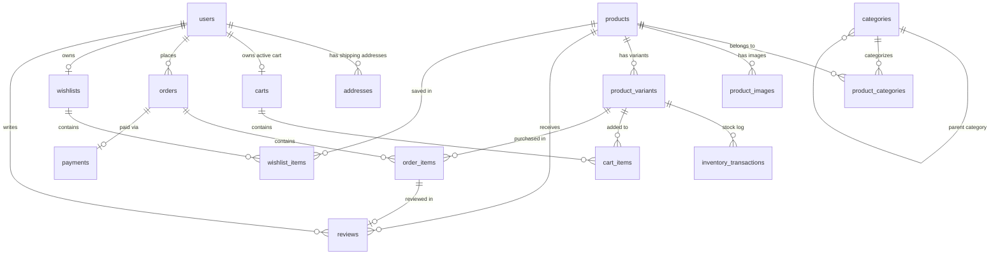

# JerseyHub Database Schema & Domain Modeling Specification

## 1. Overview

This document specifies the relational database schema, domain entity definitions, integrity constraints, indexing strategy, and auditing patterns for the **JerseyHub** e-commerce platform.

---

## 2. Entity-Relationship (ER) Diagram

---

## 3. Core Database Tables & Entity Definitions

### 1. User Domain (`users`, `addresses`)
* `users`: Primary user entity for customers and administrators (`UserRole`: `CUSTOMER`, `ADMIN`). Email addresses are unique and indexed. Passwords are never stored in plaintext (`password_hash`).
* `addresses`: Multiple shipping/billing addresses per user. `is_default` flag designates primary address.

### 2. Category Domain (`categories`)
* `categories`: Hierarchical product taxonomy with self-referencing `parent_id`. Unique `name` and URL-friendly `slug`.

### 3. Product & Variant Domain (`products`, `product_categories`, `product_images`, `product_variants`)
* `products`: Core product metadata (`name`, `slug`, `brand`, `team`, `league`, `country`, `season`, `jersey_type`, `authenticity`, `material`, `base_price`, `active`, `featured`).
* `product_categories`: Many-to-Many join table linking products and categories.
* `product_images`: Stores Cloudinary image URLs, `public_id`, `alt_text`, display ordering, and primary flag. Binary data is never stored in PostgreSQL.
* `product_variants`: Measurable purchasable SKU unit (`sku`, `size`, `price`, `stock_quantity`, `active`). Unique constraint on `(product_id, size)`.

### 4. Inventory Domain (`inventory_transactions`)
* `inventory_transactions`: Audit trail recording stock quantity changes. `transaction_type` (`RESTOCK`, `SALE`, `RETURN`, `ADJUSTMENT`, `DAMAGE`, `RESERVATION`, `RELEASE`).

### 5. Cart Domain (`carts`, `cart_items`)
* `carts`: One active cart per user.
* `cart_items`: Variant line items and quantities in a cart. Unique constraint on `(cart_id, product_variant_id)`.

### 6. Order Domain (`orders`, `order_items`)
* `orders`: Customer orders identified by unique `order_number` (e.g. `JH-20260808-000001`). Contains order status, monetary amounts (`subtotal`, `discount_amount`, `shipping_amount`, `customization_amount`, `total_amount`), and an **immutable shipping address snapshot**.
* `order_items`: Line items preserving historical product information (`product_name`, `sku`, `size`, `unit_price`, `quantity`, `customization_name`, `customization_number`, `customization_price`, `subtotal`).

### 7. Payment Domain (`payments`)
* `payments`: Maps an order to an external payment transaction ID (`transaction_id`). Gateway (`SSLCOMMERZ`), monetary amount, currency (`BDT`), status (`INITIATED`, `PENDING`, `SUCCESS`, `FAILED`, `CANCELLED`, `REFUNDED`), and timestamp `paid_at`.

### 8. Review, Wishlist, and Coupon Domains (`reviews`, `wishlists`, `wishlist_items`, `coupons`)
* `reviews`: Rating (1–5), review title/comment, `verified_purchase` flag, and admin approval status.
* `wishlists` & `wishlist_items`: Saved favorite products per user with unique `(wishlist_id, product_id)` constraint.
* `coupons`: Discount vouchers with code, discount type (`PERCENTAGE`, `FIXED_AMOUNT`), minimum order amount, maximum discount cap, usage limits, and active date range.

---

## 4. Key Architectural & Domain Rules

### 1. Order Historical Snapshot Strategy
* **Product Information**: `order_items` stores historical snapshots of `product_name`, `sku`, `size`, and `unit_price`. Changes to the product catalog later do not alter historical order totals or invoice details.
* **Shipping Address**: `orders` stores the exact shipping address fields used at checkout time. Modifying user profile addresses later does not alter completed order shipping destination records.

### 2. Monetary Precision (Numeric/BigDecimal)
* All currency/monetary fields (`base_price`, `price`, `subtotal`, `discount_amount`, `shipping_amount`, `customization_amount`, `total_amount`, `unit_price`, `discount_value`, `amount`) are stored as PostgreSQL `NUMERIC(10, 2)` and mapped to Java `java.math.BigDecimal`.
* Floating-point types (`FLOAT`, `DOUBLE`, `REAL`) are strictly forbidden for money.

### 3. Enum Persistence
* All enums are persisted as strings (`@Enumerated(EnumType.STRING)`). Ordinals are never stored to guarantee database compatibility across enum refactorings.

### 4. Primary Key & Auditing Standards
* Primary keys use `UUID` generated via PostgreSQL `gen_random_uuid()` / Java `GenerationType.UUID`.
* Timestamps (`created_at`, `updated_at`) are stored in UTC (`TIMESTAMPTZ` in PostgreSQL, `java.time.Instant` in Java).
